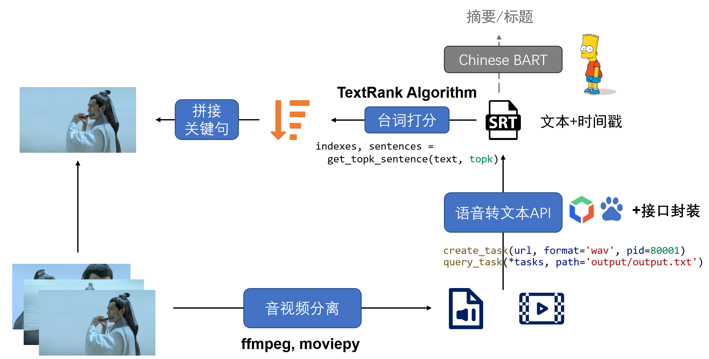

# 多媒体内容生成与传播

本项目针对“剧情类”视频实现长视频转短视频的自动剪辑功能，我们的核心技术路线如图所示：

### 目录结构

#### API

基于百度API的音频转写

- config_template.json
   保存API密钥的json文件模板，重命名为config.json并添加密钥信息
- secret.py
   根据json文件自动获取Access Token
- 其他文件
   创建和查询任务状态，输出到文件。默认输出到output文件夹

#### Summary

文本摘要和评分

- bart等文件 (训练：train_bart.py, 推断: bart_summary.py)
   
   基于BART预训练的内容摘要
   
- textRank.py

   关键句提取

- test_summary.py

   提供调用textRank和bart的示例

#### Edit

快捷编辑音视频文件

- audio.py
   提取API可翻译的wav音频文件
- 其他文件
   提供简单的视频剪辑功能
